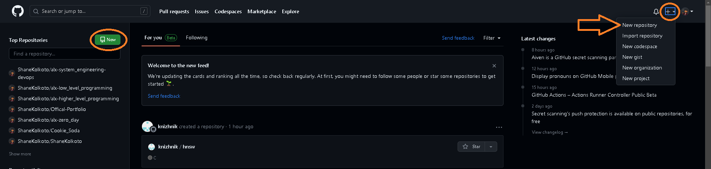
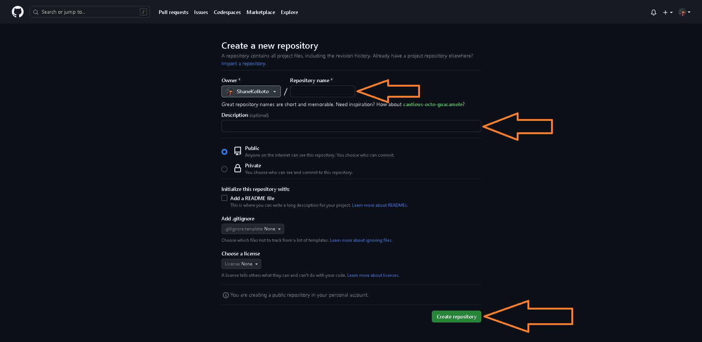
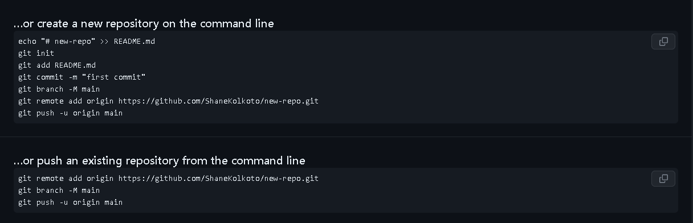
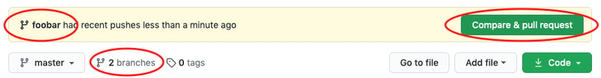
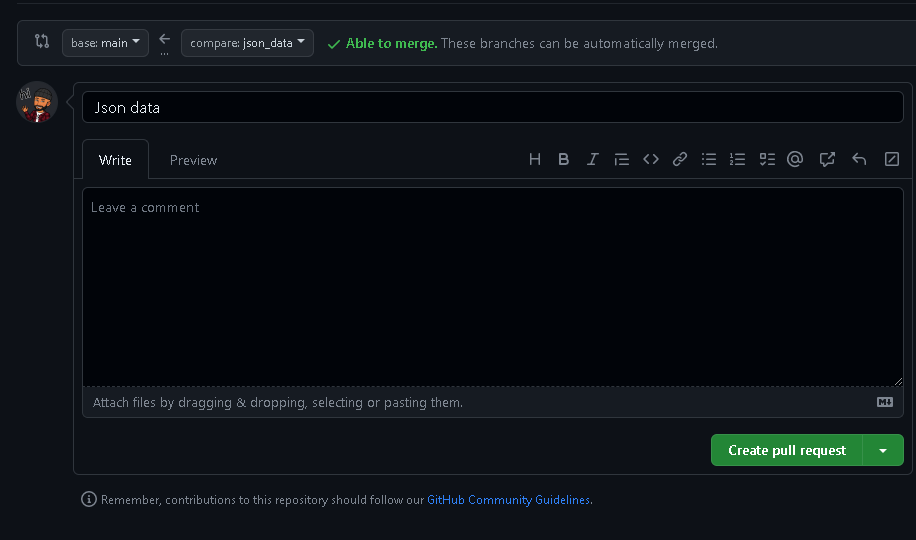
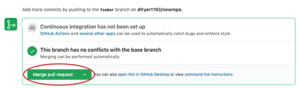

# An Intro to Git and GitHub for Beginners (Tutorial)


> __If you're new to Git and GitHub, this beginner's guide will help you get comfortable with making changes to the code base, opening a pull request (PR), and merging code into the primary branch. Familiarize yourself with the following steps and important Git and GitHub terms__:
<hr>

## Step 1: `Set Up Git and GitHub`

1. Install __Git__ on your local machine. You can find installation instructions in the official [Git Documentation](https://git-scm.com/book/en/v2/Getting-Started-Installing-Git).
    - [Windows Download](https://github.com/git-for-windows/git/releases/download/v2.40.1.windows.1/Git-2.40.1-64-bit.exe)

2. Create a __GitHub__ account at [github.com](https://github.com).

3. Configure Git with your name and email using the following commands in the __terminal__:

```bash
git config --global user.name "Your Name"
git config --global user.email "youremail@example.com"
```
<hr>

## Step 2: `Create a local git repository`

When creating a new project on your local machine using git, you'll first create a new __[repository](https://git-scm.com/book/en/v2/Git-Basics-Getting-a-Git-Repository)__ (or often, 'repo', for short).

> To use git we'll be using the terminal. If you don't have much experience with the terminal and basic commands, [check out this tutorial](https://ubuntu.com/tutorials/command-line-for-beginners#1-overview) (If you don’t want/ need a short history lesson, skip to step three.)

1. open up a terminal and move to where you want to place the project on your local machine using the cd (change directory) command. For example, if you have a 'projects' folder on your desktop, you'd do something like:
```bash
C:\Users\pc_name> cd ~/Desktop
C:\Users\pc_name\Desktop> mkdir myproject
C:\Users\pc_name\Desktop> cd myproject/
C:\Users\pc_name\Desktop\myproject> 
```

2. To initialize a git repository in the root of the folder, run the `git init` command: 
```bash
C:\Users\pc_name\Desktop\myproject> git init
C:\Users\pc_name\Desktop\myproject> Initialized empty Git repository in /Users/pc_name/Desktop/myproject/.git/
```
<hr>

## Step 3: `Add a new file to the local repo`   

> Go ahead and add a new file to the project, using any text editor you like or running a touch command. `touch newfile.txt` just creates and saves a blank file named newfile.txt. 

1. Once you've added or modified files in a folder containing a git repo, git will notice that  the file exists inside the repo. But, git won't track the file unless you explicitly tell it to. Git only saves/manages changes to files that it tracks, so we’ll need to send a command to confirm that yes, we want git to track our new file.

```bash
C:\Users\pc_name\Desktop\myproject> touch newfile.txt
C:\Users\pc_name\Desktop\myproject> ls
C:\Users\pc_name\Desktop\myproject> newfile.txt
```
2. After creating the new file, you can use the git status command to see which files git knows exist.
```bash
C:\Users\pc_name\Desktop\myproject> git status
C:\Users\pc_name\Desktop\myproject> On branch master

C:\Users\pc_name\Desktop\myproject> Initial commit

C:\Users\pc_name\Desktop\myproject> Untracked files:
  (use "git add <file>..." to include in what will be committed)

	newfile.txt

nothing added to commit but untracked files present (use "git add" to track)
```

What this basically says is, "Hey, we noticed you created a new file called mnelson.txt, but unless you use the 'git add' command we aren't going to do anything with it."

<section style="border-left: 2px solid red; padding-left: 5px">

<h2>An interlude: The staging environment, the commit, and you</h2>
One of the most confusing parts when you're first learning git is the concept of the staging environment and how it relates to a commit.

A [commit](https://docs.github.com/en/get-started/quickstart/github-glossary) is a record of what changes you have made since the last time you made a commit. Essentially, you make changes to your repo (for example, adding a file or modifying one) and then tell git to put those changes into a commit.

Commits make up the essence of your project and allow you to jump to the state of a project at any other commit.

So, how do you tell git which files to put into a commit? This is where the [staging environment or index](https://git-scm.com/book/en/v2/Git-Basics-Recording-Changes-to-the-Repository) come in. As seen in Step 2, when you make changes to your repo, git notices that a file has changed but won't do anything with it (like adding it in a commit).

To add a file to a commit, you first need to add it to the staging environment. To do this, you can use the [git add ](https://git-scm.com/docs/git-add) `filename` command (see Step 3 below).

Once you've used the git add command to add all the files you want to the staging environment, you can then tell git to package them into a commit using the git commit command. 

Note: The staging environment, also called 'staging', is the new preferred term for this, but you can also see it referred to as the 'index'.
</section>

## Step 4: `Add a file to the staging environment`

Add a file to the staging environment using the `git add` command. 

1. If you rerun the git status command, `you'll see that git has added the file to the staging environment` (notice the "Changes to be committed" line). 
```bash
C:\Users\pc_name\Desktop\myproject> git status
On branch master

Initial commit

Changes to be committed:
  (use "git rm --cached <file>..." to unstage)

	new file:   newfile.txt
```
> To reiterate, the file has not yet been added to a commit, but it's about to be.

<hr>

## Step 5: Create a commit
## It's time to create your first commit!

> Run the command `git commit -m "Your message about the commit"`

```bash 
C:\Users\pc_name\Desktop\myproject> git commit -m "This is my first commit!"
[master (root-commit) b345d9a] This is my first commit!
 1 file changed, 1 insertion(+)
 create mode 100644 newile.txt
```
> The message at the end of the commit should be something related to what the commit contains - maybe it's a new feature, maybe it's a bug fix, maybe it's just fixing a typo. Don't put a message like "asdfadsf" or "foobar". That makes the other people who see your commit sad. Very, very, sad. Commits live forever in a repository (technically you can delete them if you really, really need to but it’s messy), so if you leave a clear explanation of your changes it can be extremely helpful for future programmers (perhaps future you!) who are trying to figure out why some change was made years later.
<hr>

## Step 6: Create a new branch

Now that you've made a new commit, let's try something a little more advanced.

Say you want to make a new feature but are worried about making changes to the main project while developing the feature. This is where [git branches](https://git-scm.com/book/en/v2/Git-Branching-Branches-in-a-Nutshell) come in.

> Branches allow you to move back and forth between 'states' of a project. Official git docs describe branches this way: ‘A branch in Git is simply a lightweight movable pointer to one of these commits.’ For instance, if you want to add a new page to your website you can create a new branch just for that page without affecting the main part of the project. Once you're done with the page, you can [merge](https://git-scm.com/book/en/v2/Git-Branching-Basic-Branching-and-Merging) your changes from your branch into the primary branch. When you create a new branch, Git keeps track of which commit your branch 'branched' off of, so it knows the history behind all the files. 

Let's say you are on the primary branch and want to create a new branch to develop your web page. Here's what you'll do: Run [git checkout -b](https://git-scm.com/docs/git-checkout) `my_branch_name`. This command will automatically create a new branch and then 'check you out' on it, meaning git will move you to that branch, off of the primary branch.

After running the above command, you can use the git branch command to confirm that your branch was created:

```bash
C:\Users\pc_name\Desktop\myproject> git branch
  master
* foobar
```
> The branch name with the asterisk next to it indicates which branch you're on at that given time.

<section style="border-left: 2px solid red; padding-left: 5px">

<h2>A note on branch names</h2>
By default, every git repository’s first branch is named `master` (and is typically used as the primary branch in the project). As part of the tech industry’s general anti-racism work, some groups have begun to use alternate names for the default branch (we are using “primary” in this tutorial, for example). In other documentation and discussions, you may see “master”, or other terms, used to refer to the primary branch. Regardless of the name, just keep in mind that nearly every repository has a primary branch that can be thought of as the official version of the repository. If it’s a website, then the primary branch is the version that users see. If it’s an application, then the primary branch is the version that users download. This isn’t technically necessary (git doesn’t treat any branches differently from other branches), but it’s how git is traditionally used in a project.

If you are curious about the decision to use different default branch names, GitHub has an explanation of their change here: https://github.com/github/renaming

Now, if you switch back to the primary branch and make some more commits, your new branch won't see any of those changes until you [merge](https://git-scm.com/docs/git-merge) those changes onto your new branch.
</section>
<hr>

## Step 7: Create a new repository on GitHub

If you only want to keep track of your code locally, you don't need to use [GitHub](https://github.com). But if you want to work with a team, you can use [GitHub](https://github.com) to collaboratively modify the project's code.

> To create a new repo on [GitHub](https://github.com), log in and go to the [GitHub](https://github.com) home page. You can find the “New repository” option under the `+` sign next to your profile picture, in the top right corner of the navbar:



## After clicking the button, GitHub will ask you to name your repo and provide a brief description:



> When you're done filling out the information, press the 'Create repository' button to make your new repo.

⚠️⚠️⚠️⚠️⚠️⚠️⚠️⚠️⚠️⚠️⚠️⚠️⚠️⚠️⚠️⚠️⚠️⚠️⚠️⚠️⚠️⚠️⚠️⚠️⚠️⚠️⚠️⚠️⚠️⚠️⚠️⚠️⚠️⚠️⚠️⚠️⚠️

> GitHub will ask if you want to create a new repo from scratch or if you want to add a repo you have created locally. In this case, `since we've already created a new repo locally, we want to push that onto GitHub so follow the` ....or push an existing repository from the command line' section: 



⚠️⚠️⚠️⚠️⚠️⚠️⚠️⚠️⚠️⚠️⚠️⚠️⚠️⚠️⚠️⚠️⚠️⚠️⚠️⚠️⚠️⚠️⚠️⚠️⚠️⚠️⚠️⚠️⚠️⚠️⚠️⚠️⚠️⚠️⚠️⚠️⚠️

```bash 
C:\Users\pc_name\Desktop\myproject> git remote add origin https://github.com/ShaneKolkoto/new-repo.git
C:\Users\pc_name\Desktop\myproject> git push -u origin master
Counting objects: 3, done.
Writing objects: 100% (3/3), 263 bytes | 0 bytes/s, done.
Total 3 (delta 0), reused 0 (delta 0)
To https://github.com/ShaneKolkoto/new-repo.git
 * [new branch]      master -> master
Branch master set up to track remote branch master from origin.
```
> `(You'll want to change the URL in the first command line to what GitHub lists in this section since your GitHub username and repo name are different.)`
<hr>

## Step 8: Push a branch to GitHub

> Now we'll push the commit in your branch to your new GitHub repo. This allows other people to see the changes you've made. If they're approved by the repository's owner, the changes can then be merged into the primary branch.

To push changes onto a new branch on GitHub, you'll want to run [git push](https://git-scm.com/docs/git-push) origin yourbranchname. GitHub will automatically create the branch for you on the remote repository:

```bash 
C:\Users\pc_name\Desktop\myproject> git push origin foobar
Counting objects: 3, done.
Delta compression using up to 8 threads.
Compressing objects: 100% (2/2), done.
Writing objects: 100% (3/3), 313 bytes | 0 bytes/s, done.
Total 3 (delta 0), reused 0 (delta 0)
To https://github.com/ShaneKolkoto/new-repo.git
 * [new branch]      foobar -> foobar
```

⚠️⚠️⚠️⚠️⚠️⚠️⚠️⚠️⚠️⚠️⚠️⚠️⚠️⚠️⚠️⚠️⚠️⚠️⚠️⚠️⚠️⚠️⚠️⚠️⚠️⚠️⚠️⚠️⚠️⚠️⚠️⚠️⚠️⚠️⚠️⚠️⚠️

You might be wondering what that "origin" word means in the command above. What happens is that when you clone a remote repository to your local machine, git creates an alias for you. In nearly all cases this alias is called [origin](https://git-scm.com/book/en/v2/Git-Basics-Working-with-Remotes) It's essentially shorthand for the remote repository's URL. So, to push your changes to the remote repository, you could've used either the command: git push git@github.com:git/git.git yourbranchname or git push origin yourbranchname

> (If this is your first time using GitHub locally, it might prompt you to log in with your GitHub username and password.)

If you refresh the GitHub page, you'll see note saying a branch with your name has just been pushed into the repository. You can also click the 'branches' link to see your branch listed there.



⚠️⚠️⚠️⚠️⚠️⚠️⚠️⚠️⚠️⚠️⚠️⚠️⚠️⚠️⚠️⚠️⚠️⚠️⚠️⚠️⚠️⚠️⚠️⚠️⚠️⚠️⚠️⚠️⚠️⚠️⚠️⚠️⚠️⚠️⚠️⚠️⚠️
<hr>

## Step 9: `Create a pull request (PR)`

A pull request (or PR) is a way to alert a repo's owners that you want to make some changes to their code. It allows them to review the code and make sure it looks good before putting your changes on the primary branch.

This is what the PR page looks like before you've submitted it:


> And this is what it looks like once you've submitted the PR request:



You might see a big green button at the bottom that says `Merge pull request`. Clicking this means you'll merge your changes into the primary branch..

Sometimes you'll be a co-owner or the sole owner of a repo, in which case you may not need to create a PR to merge your changes. However, it's still a good idea to make one so you can keep a more complete history of your updates and to make sure you always create a new branch when making changes.
<hr>

## Step 10: Merge a PR

> Go ahead and click the green `Merge pull request` button. This will merge your changes into the primary branch.

- When you're done, I recommend _deleting your branch_ (too many branches can become messy), so hit that grey '_Delete branch_' button as well.

- You can double check that your _commits_ were merged by clicking on the '_Commits_' link on the first page of your new repo.

- This will show you a list of all the commits in that branch. You can see the one I just merged right up top (Merge pull request #1).

- You can also see the [hash](https://git-scm.com/docs/git-hash-object) code of the commit on the right hand side. A hash code is a unique identifier for that specific commit. It's useful for referring to specific commits and when undoing changes (use the [git revert](https://git-scm.com/docs/git-revert) `<hash code number>` command to backtrack).
<hr>

## Step 11: Get changes on GitHub back to your computer

> Right now, the repo on GitHub looks a little different than what you have on your local machine. For example, the commit you made in your branch and merged into the primary branch doesn't exist in the primary branch on your local machine.

In order to get the most recent changes that you or others have merged on GitHub, use the `git pull origin master` command (when working on the primary branch). In most cases, this can be shortened to `git pull`.

```bash
C:\Users\pc_name\Desktop\myproject> git pull origin master
remote: Counting objects: 1, done.
remote: Total 1 (delta 0), reused 0 (delta 0), pack-reused 0
Unpacking objects: 100% (1/1), done.
From https://github.com/ShaneKolkoto/new-repo
 * branch            master     -> FETCH_HEAD
   b345d9a..5381b7c  master     -> origin/master
Merge made by the 'recursive' strategy.
 mnelson.txt | 1 +
 1 file changed, 1 insertion(+)
```

> This shows you all the files that have changed and how they've changed.

- Now we can use the [git log](https://git-scm.com/docs/git-log) command again to see all new commits.

> (You may need to switch branches back to the primary branch. You can do that using the git checkout master command.)
```bash
C:\Users\pc_name\Desktop\myproject> git log
commit 3e270876db0e5ffd3e9bfc5edede89b64b83812c
Merge: 4f1cb17 5381b7c
Author: Shane Kolkoto <shanekolkoto@gmail.com>
Date:   Fri Sep 11 17:48:11 2015 -0400

    Merge branch 'master' of https://github.com/ShaneKolkoto/new-repo

commit 4f1cb1798b6e6890da797f98383e6337df577c2a
Author: Shane Kolkoto <shanekolkoto@gmail.com>
Date:   Fri Sep 11 17:48:00 2015 -0400

    added a new file

commit 5381b7c53212ca92151c743b4ed7dde07d9be3ce
Merge: b345d9a 1e8dc08
Author: Shane Kolkoto <shanekolkoto@gmail.com>
Date:   Fri Sep 11 17:43:22 2015 -0400

    Merge pull request #2 from cubeton/my-newbranch
    
    Added some more text to my file

commit 1e8dc0830b4db8c93efd80479ea886264768520c
Author: Shane Kolkoto <shanekolkoto@gmail.com>
Date:   Fri Sep 11 17:06:05 2015 -0400

    Added some more text to my file

commit b345d9a25353037afdeaa9fcaf9f330effd157f1
Author: Shane Kolkoto <shanekolkoto@gmail.com>
Date:   Thu Sep 10 17:42:15 2015 -0400

    This is my first commit!
```

## Step 11: Bask in your git glory
🥳🎇🎇🎇🎇🍾🍾🍾🍾🍾🍾🍾🍾🍾🍾🍾🍾🍾🍾🍾🍾🍾🍾🍾🍾🍾🍾🍾🍾🍾🍾🍾🎇🎇🎇🎇🥳
> You've successfully made a PR and merged your code to the primary branch. Congratulations! If you'd like to dive deeper, check out these more advanced tutorials and resources:

- [GitHub Training Kit](https://training.github.com/ )<br>
Github’s official git cheat sheets! Handy for remembering the everyday commands you’ll use. 

- [Learn Git Branching](https://learngitbranching.js.org/) <br>
Confused or intrigued by git’s branch system? That just means you’re human! It’s one of the deepest parts of git, but also arguably the most powerful. Understanding the branch model gives you git superpowers, and this tutorial gives you a way to learn git branches in a visual, intuitive way.

- [Visualizing Git](https://git-school.github.io/visualizing-git) <br>
Another tool for exploring git visually. This one is more of an open-ended sandbox than learngitbranching.js.org

- [Git-it (Desktop App)](https://github.com/jlord/git-it-electron) <br>
A desktop application that helps you learn git through challenges you have to solve. It has a series of levels, each requiring you to use git commands to arrive at a correct answer.

- [Githug](https://github.com/Gazler/githug) <br>
If you liked git-it, Githug is another puzzle-based tutorial designed to give you a practical way of learning git.

> I also recommend finding some time to work with your team on simulating a smaller group project like we did here. Have your team make a new folder with your team name, and add some files with text to it. Then, try pushing those changes to this remote repo. That way, your team can start making changes to files they didn't originally create and practice using the PR feature. And, use the git blame and git history tools on GitHub to get familiar with tracking which changes have been made in a file and who made those changes. 

🥳🎇🎇🎇🎇🍾🍾🍾🍾🍾🍾🍾🍾🍾🍾🍾🍾🍾🍾🍾🍾🍾🍾🍾🍾🍾🍾🍾🍾🍾🍾🍾🎇🎇🎇🎇🥳
<hr
>
⚠️⚠️⚠️⚠️⚠️⚠️⚠️⚠️⚠️⚠️⚠️⚠️⚠️⚠️⚠️⚠️⚠️⚠️⚠️⚠️⚠️⚠️⚠️⚠️⚠️⚠️⚠️⚠️⚠️⚠️⚠️⚠️⚠️⚠️⚠️⚠️⚠️

## The more you use git, the more comfortable you'll... git with it. (I couldn't resist.)

⚠️⚠️⚠️⚠️⚠️⚠️⚠️⚠️⚠️⚠️⚠️⚠️⚠️⚠️⚠️⚠️⚠️⚠️⚠️⚠️⚠️⚠️⚠️⚠️⚠️⚠️⚠️⚠️⚠️⚠️⚠️⚠️⚠️⚠️⚠️⚠️⚠️